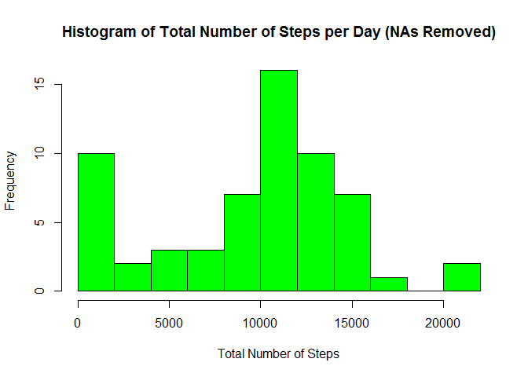
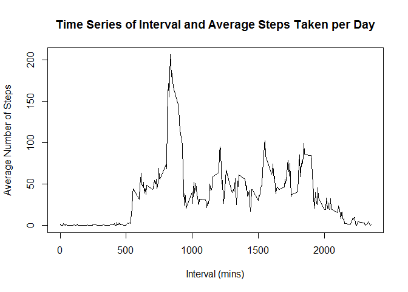
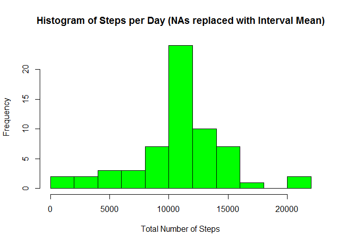
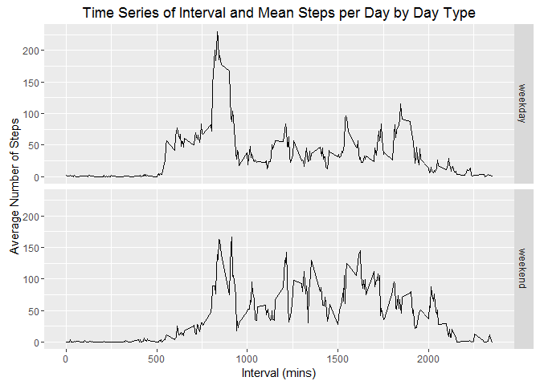

# Reproducible Research: Peer Assessment 1

## Load and preprocess the data

For this project we will assume that *setwd()* is already set to the proper
working directory.  In this working directory should exist only the data package:
*repdata-data-activity.zip*.

1. Load the data (i.e. read.csv()).  

In this section we will also set the default options of echo = TRUE and clear
all environment variables in the workspace to ensure it is clean.


```r
## Set default options to echo=TRUE (this threw an error so omitting for now)
#opts_chunk$set(echo = TRUE)

## Clear all environment variables for a clean workspace
rm(list=ls())

## Unzip the package and read the raw data
unzip(zipfile="repdata-data-activity.zip")
rawData <- read.csv("activity.csv", stringsAsFactors=FALSE)
```

2. Process/transform the data (if necessary) into a format suitable for your
analysis.  

Set the date column as a Date type.  
Reorder columns so date is first, then interval, then steps.


```r
## Set date column to Date format
rawData$date <- as.Date(rawData$date, format="%Y-%m-%d")

## Reorganize columns
rawData <- rawData[,c("date","interval","steps")]
```

## What is mean total number of steps taken per day?

Ignore the missing values in the dataset per the assignment instructions.

1. Calculate the total number of steps taken per day.

To do this, use tapply.


```r
## Sum number of steps by date using tapply
stepsTotal <- tapply(rawData$steps, rawData$date, FUN=sum, na.rm=TRUE)
```

2. Make a histogram of the total number of steps taken each day.


```r
hist(stepsTotal, breaks=10, col="green", 
     main="Histogram of Total Number of Steps per Day (NAs Removed)", 
     xlab="Total Number of Steps")
```



3. Calculate and report the mean and median of the total number of steps taken
per day.  

Calculate mean and median on *stepsTotal*

```r
mean(stepsTotal)
```

```
## [1] 9354.23
```

```r
median(stepsTotal)
```

```
## [1] 10395
```

## What is the average daily activity pattern?

1. Make a time series plot (i.e. type = "l") of the 5-minute interval (x-axis)
and the average number of steps taken, averaged across all days (y-axis).  

First use aggregate to get averages of steps across all intervals, then plot.  


```r
## First get the averages of steps across all intervals
aveData <- aggregate(rawData$steps, by=list(rawData$interval), FUN=mean, na.rm=TRUE)

## Rename columns to make more readable
names(aveData) <- c("interval", "average")

plot(aveData$interval, aveData$average, type="l", 
     main="Time Series of Interval and Average Steps Taken per Day", 
     xlab="Interval (mins)", 
     ylab="Average Number of Steps")
```



2. Which 5-minute interval, on average across all the days in the dataset,
contains the maximum number of steps?  

Find the maximum position with which.max, then get item at that index.  


```r
## Get the index of the maximum average value
maxIndex <- which.max(aveData$average)

## Output the interval at that index
aveData[maxIndex,]$interval
```

```
## [1] 835
```


## Imputing missing values

Note that there are a number of days/intervals where there are missing values
(coded as NA). The presence of missing days may introduce bias into some
calculations or summaries of the data.  

1. Calculate and report the total number of missing values in the dataset (i.e.
the total number of rows with NAs).  

Use is.na to find missing values, then sum up logical vector to get the total
number.  


```r
## Find missing values with is.na in the steps column
missingValues <- is.na(rawData$steps)

## Sum up logical vector to find out the total number of missing values
sum(missingValues)
```

```
## [1] 2304
```

2. Devise a strategy for filling in all of the missing values in the dataset.
The strategy does not need to be sophisticated. For example, you could use the
mean/median for that day, or the mean for that 5-minute interval, etc.

Using strategy whereby the NAs are replaced by the average steps for the
corresponding 5-minute interval.  

For loop that walks over data frame, filling in missing values with the average
steps value from the calculated value for the corresponding interval.  


```r
## Make new data set that is copy of rawData, NAs will be filled in.
filledInData <- rawData

## For loop, for each row, if it is NA, replace NA value with corresponding 
## average for that interval
for (i in 1:nrow(filledInData)) {
    if (is.na(filledInData[i,]$steps)) {
        filledInData[i,]$steps <- aveData[aveData$interval==filledInData[i,]$interval,]$average
    }
}

## Verify that NAs are filled in by comparing heads of rawData with new DF.
head(rawData)
```

```
##         date interval steps
## 1 2012-10-01        0    NA
## 2 2012-10-01        5    NA
## 3 2012-10-01       10    NA
## 4 2012-10-01       15    NA
## 5 2012-10-01       20    NA
## 6 2012-10-01       25    NA
```

```r
head(filledInData)
```

```
##         date interval     steps
## 1 2012-10-01        0 1.7169811
## 2 2012-10-01        5 0.3396226
## 3 2012-10-01       10 0.1320755
## 4 2012-10-01       15 0.1509434
## 5 2012-10-01       20 0.0754717
## 6 2012-10-01       25 2.0943396
```

3. Create a new dataset that is equal to the original dataset but with the
missing data filled in.  

This was done in the previous step.  

4. Make a histogram of the total number of steps taken each day and Calculate
and report the mean and median total number of steps taken per day. Do these
values differ from the estimates from the first part of the assignment? What is
the impact of imputing missing data on the estimates of the total daily number
of steps?  

Do same steps as per second question above just with new data.  


```r
## Sum steps by date using tapply
newStepsTotal <- tapply(filledInData$steps, filledInData$date, FUN=sum)

hist(newStepsTotal, breaks=10, col="green", 
     main="Histogram of Steps per Day (NAs replaced with Interval Mean)", 
     xlab="Total Number of Steps")
```



Now display mean and median for new data, *newStepsTotal*.


```r
mean(newStepsTotal)
```

```
## [1] 10766.19
```

```r
median(newStepsTotal)
```

```
## [1] 10766.19
```

So the biggest difference comes from the fact that the NAs were set to 0 in the
initial histogram, making the 0 bucket quite large due to the large number of
NAs.  However, once the NAs were replaced with the 5-minute interval averages,
they were more distributed throughout the histogram.  Also, due to the new input
of new data, the mean and median increased.

## Are there differences in activity patterns between weekdays and weekends?

For this part the weekdays() function may be of some help here. Use the dataset
with the filled-in missing values for this part.

1. Create a new factor variable in the dataset with two levels - "weekday" and
"weekend" indicating whether a given date is a weekday or weekend day.

First, create new day column that is a factor of weekend or weekday.  
Then, iterate over the dataframe setting new day column to weekday or weekend as
appropriate.  


```r
## Create new factor column for day type (weekday or weekend)
filledInData$day <- as.factor(c("weekday","weekend"))

## Loop over df, get day name, apply proper day type based on name of the day
for (i in 1:nrow(filledInData)) {
    day <- weekdays(filledInData[i,]$date)
    if (day %in% c("Monday","Tuesday","Wednesday","Thursday","Friday")) {
        filledInData[i,]$day <- "weekday"
    } else {
        filledInData[i,]$day <- "weekend"
    }
}
```

2. Make a panel plot containing a time series plot (i.e. type = "l") of the
5-minute interval (x-axis) and the average number of steps taken, averaged
across all weekday days or weekend days (y-axis). See the README file in the
GitHub repository to see an example of what this plot should look like using
simulated data.

First, do aggregate to get averaged step values by interval and day.
Then, plot this using ggplot2 (it was easier to do this using ggplot2 than the
base plotting system)


```r
## Use aggregate to get the averaged step values by interval and day
newAveData <- aggregate(filledInData$steps, by=list(filledInData$interval, filledInData$day), FUN=mean)

## Make column names more readable
names(newAveData) <- c("interval", "day", "average")

## Load ggplot2 library
library(ggplot2)
ggplot(newAveData, aes(interval, average)) + geom_line() + facet_grid(day ~ .) +
    ggtitle("Time Series of Interval and Mean Steps per Day by Day Type") +
    xlab("Interval (mins)") + ylab("Average Number of Steps")
```


